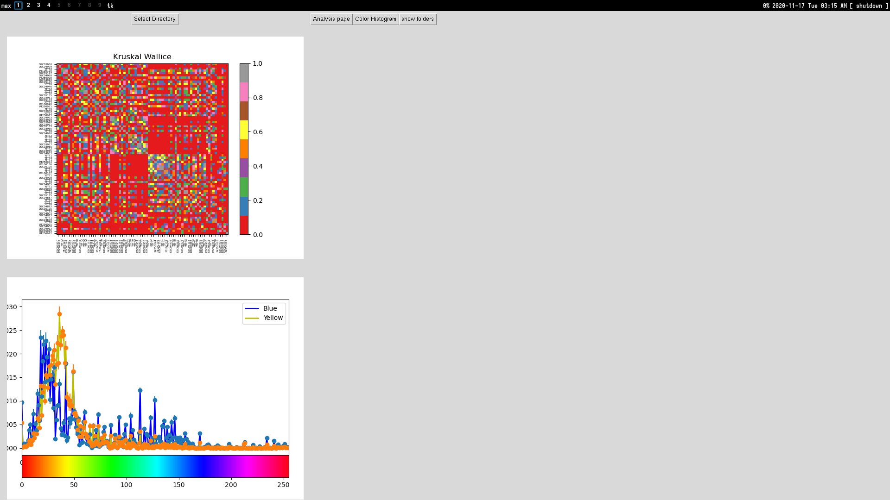

# Gui for Quantification of color
> In early stages, visualizations are from test data and not representative of a final visualizaiton

Processes folders of photos and creates a dataframe for analysis. Current implementation works with hue, but switching to any other value is not difficult
Two visualizations are: Heatmap of a Kruskall Wallice test comparing individual photos and a histogram of binned hues by folder

