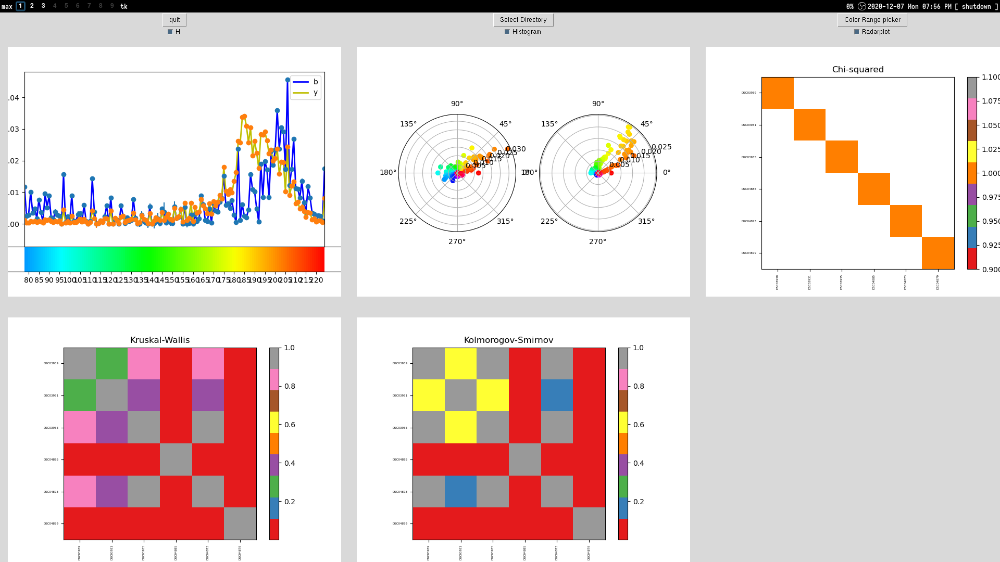
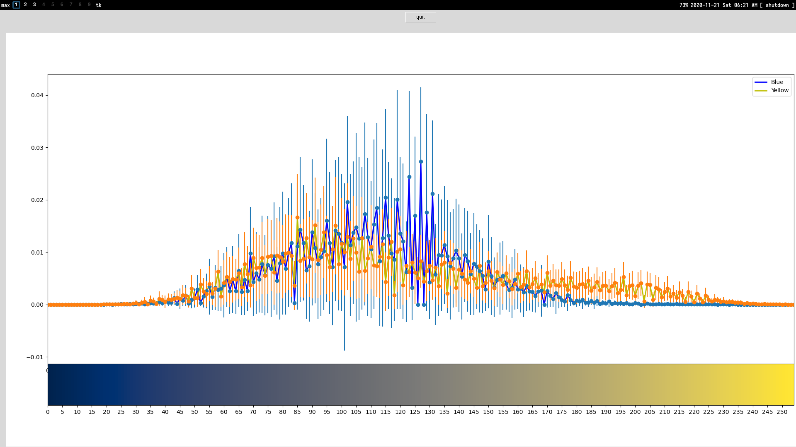
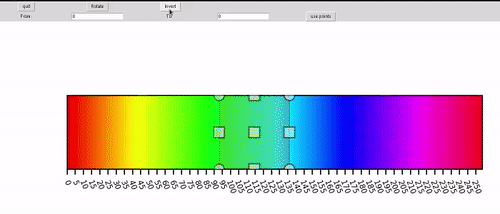

# Gui for Quantification of color
> - In early stages. The main useful file is analysisGui.py where all other files are test functions
> - Current tests included Chi-Squared, Kruskal-Wallis, Kolmorogov-Smirnov (see function definitions of kruskal, chisquared, kstest for how to implement custom statistical tests)

Processes folders of photos and creates a dataframe for analysis. Current implementation works with hue, but switching to any other value is not difficult
Objects must be segmented on a white background using Segmenting tool described in (link to segmentation tool)
Select a channel from a color space and run analysis (example is of hue)

Included options to export data and graphs of specified dimensions

Analysis includes:
- Histogram
- Radar Plot
- Heatmap comparing statistics/p-values of a given test

Histogram of CIE L\*a\*b channel 2

Added color range selection
Select by:
- Direct values
- Dragging window
- Inverting selection
- Rotating color bar to center specified region

